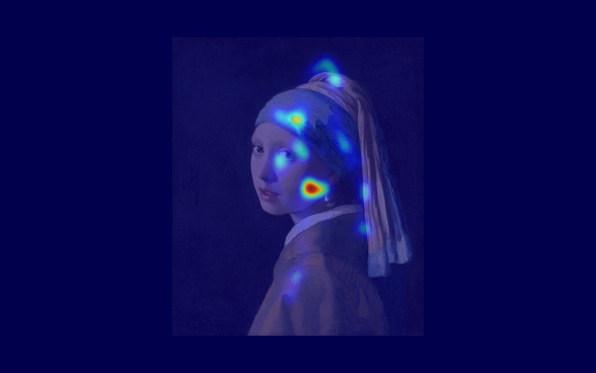

# EyeTracker

A webcam-based eye-tracking tool for studying where people look at images. It calibrates to your face using [MediaPipe](https://google.github.io/mediapipe/) Face Mesh and OpenCV, then tracks your gaze in real time and records fixation data as you view a set of stimulus images — producing heatmaps and gaze-path maps afterward.



## Features

- Webcam-only gaze tracking — no special hardware, just a standard camera.
- 9-point calibration with a small regression model mapping gaze position + head yaw/pitch to screen coordinates.
- Head-position lock: after the first calibration point, a reference head position is captured, and an on-screen box turns red if you drift too far from it (the model loses accuracy outside that range).
- Image presentation sessions — load a folder of images, and the app shows them full-screen in sequence while recording gaze coordinates and timestamps.
- Full-screen UI with calibration progress, a live gaze cursor trail, session countdowns, and a camera preview.
- Post-session analysis (`heatmap_Interpreter.py`) turns a recorded session into a heatmap (blurred gaze density over the image) and a gaze map (numbered fixation points connected in viewing order).

## How it works

1. **Calibration** — Look at 9 dots in sequence (corners, edges, and center of the screen) and press `C` to lock in each one. The app averages ~25 frames per point and fits a small quadratic regression mapping normalized iris position + head yaw/pitch to screen coordinates.
2. **Head lock** — Your head position, distance from the camera, and orientation during the first calibration point become the reference. If you drift too far from it afterward, the camera preview outlines your face in red instead of green.
3. **Image session** — Import a folder of images. The app shows each one full-screen for a fixed duration, recording your gaze `(x, y)` at each frame along with the image ID and timestamp.
4. **Save** — At the end of a session, gaze data is written as JSON to `gaze_sessions/`.
5. **Analyze** — Run `heatmap_Interpreter.py`, pick the session JSON and the folder of images shown during it, and it generates a heatmap + gaze map PNG for each image.

## Requirements

- Python 3.9+
- A webcam
- Dependencies:
  ```bash
  pip install opencv-python mediapipe numpy pillow
  ```
  (`tkinter` ships with most standard Python installs; on Linux you may need `sudo apt install python3-tk`.)

## Usage

### 1. Run the tracker

```bash
python main.py
```

- Press any key at the splash/instructions screen to begin calibration.
- Look at each of the 9 dots and press **`C`** to capture it.
- Once calibrated, the app moves into tracking mode with a live gaze cursor.

### Controls

| Key | Action |
|---|---|
| `C` | Capture the current calibration point |
| Any key | Advance past splash / instructions screens |
| `S` | Start a new image session (after loading images) |
| `R` | Recalibrate |
| `Backspace` | Toggle head-position lock override |
| Arrow keys | (used during correction / fine-tuning mode) |
| `D` | Toggle debug overlay (pose landmarks, yaw/pitch readout) |

### 2. Run an image session

From the tracker, import a folder of images and start the timed presentation. Gaze data is recorded automatically for each image shown and saved as a JSON file in `gaze_sessions/` when the session completes.

### 3. Generate heatmaps and gaze maps

```bash
python heatmap_Interpreter.py
```

- Select the session JSON file from `gaze_sessions/`.
- Select the folder containing the images used in that session.
- For each image, a `heatmap_<image>.png` and `gazemap_<image>.png` will be saved.

## Project structure

```
EyeTracker/
├── main.py                  # Calibration, tracking, and image-session UI
├── heatmap_Interpreter.py   # Post-session heatmap / gaze map generator
├── fonts/                   # UI font (Inter)
├── gaze_sessions/           # Recorded session JSON output
└── images/                  # Sample stimulus / output images
```

## Notes & limitations

- Developed and tested entirely on one laptop with its built-in webcam. No idea how it holds up with an external webcam, a different resolution, or another machine.
- Accuracy depends on staying near the head position and distance used during calibration — that's what the head-lock indicator is for.
- Tested on Windows; the fallback font path (`FONT_FALLBACK`) is Windows-specific and will need changing on macOS/Linux.
- Personal project, not a production eye tracker — expect some drift and occasional recalibration.
